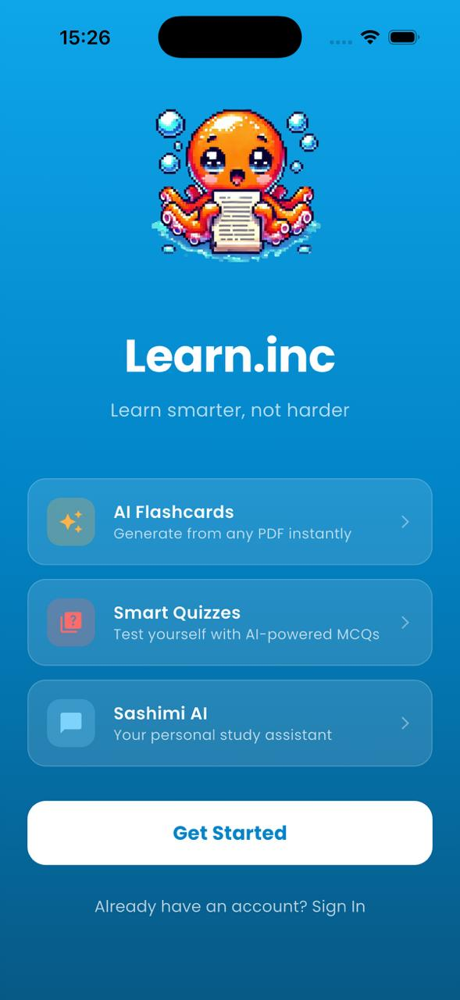
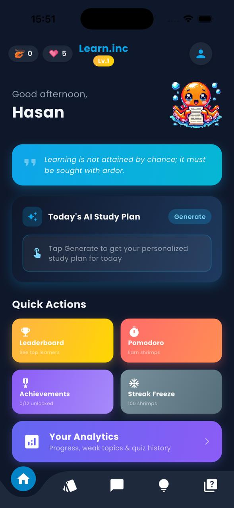
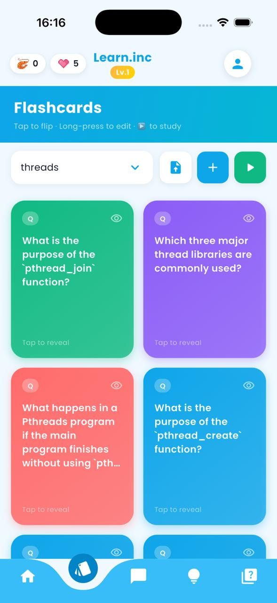
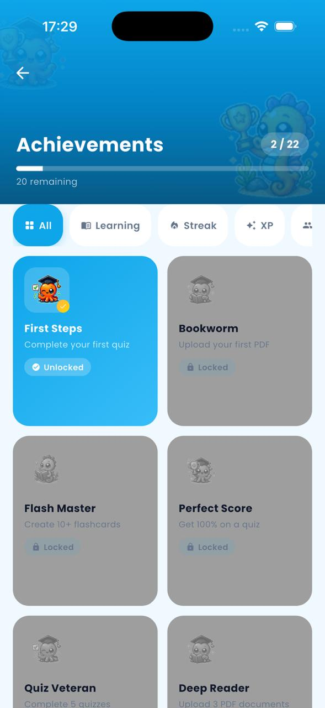

<div align="center">
  
  
  # Learn.inc
  ### AI-Powered Student Productivity App
</div>

> *From PDF to quiz in seconds. Study smarter, not harder.*


---

## 📌 Problem

Students waste hours manually turning lecture notes and PDFs into study materials. Existing flashcard apps require manual input and don't adapt to how well you actually retain information.

## 💡 Solution

A cross-platform mobile app that **automatically generates quizzes and flashcards from uploaded PDFs** using Google Gemini, then schedules review sessions based on spaced repetition to maximize retention.

---

## 📸 Screenshots

<p align="center">
  
  
</p>

<p align="center">
  
  
</p>

---

## ⚙️ Architecture

```
┌─────────────────────────────────────────┐
│              Flutter App                │
│  ┌──────────┐  ┌────────────────────┐  │
│  │  Student │  │  Teacher Dashboard │  │
│  │  View    │  │  (Role-based)      │  │
│  └────┬─────┘  └────────┬───────────┘  │
└───────┼─────────────────┼──────────────┘
        │                 │
        ▼                 ▼
┌───────────────────────────────┐
│           Firebase            │
│  Auth · Firestore · Storage   │
└───────────────┬───────────────┘
                │
                ▼
┌───────────────────────────────┐
│        Google Gemini API      │
│  PDF parsing · Quiz gen       │
│  Flashcard generation         │
└───────────────────────────────┘
```

## 🛠 Tech Stack

| Layer | Technology |
|---|---|
| Mobile | Flutter (Dart) |
| State Management | Provider / Bloc |
| Backend | Firebase (Auth, Firestore, Storage) |
| AI | Google Gemini API |
| Distribution | App Store · Google Play |

---

## ✨ Key Features

- **AI Quiz Generation** — Upload any PDF, get a ready quiz in seconds via Gemini
- **Flashcard Engine** — Auto-generated cards with spaced repetition scheduling
- **XP & Level System** — Gamified progress to keep students engaged
- **Real-time Leaderboard** — Compete with classmates
- **Role-based Dashboards** — Separate views for students and teachers

---

## 👥 Team

Built by a 2-person team.

| Member | Profile |
| :--- | :--- |
| **Gülfem Küpeli** | [@GulfemKupeli](https://github.com/GulfemKupeli) |
| **Hasan Hazırbulan** | [@hasanhazirbulan](https://github.com/hasanhazirbulan) |

---

## 🚀 Availability

Planned release on **App Store** and **Google Play**.
